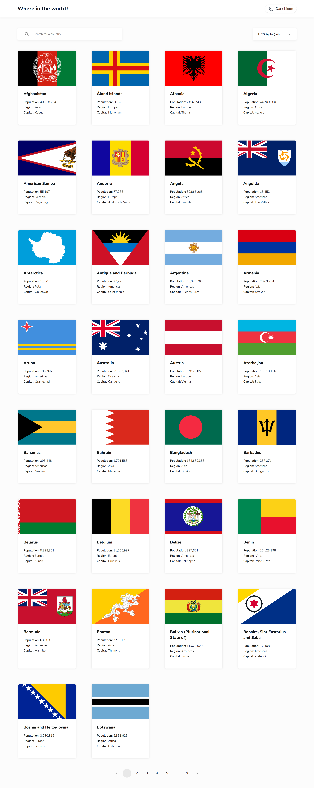
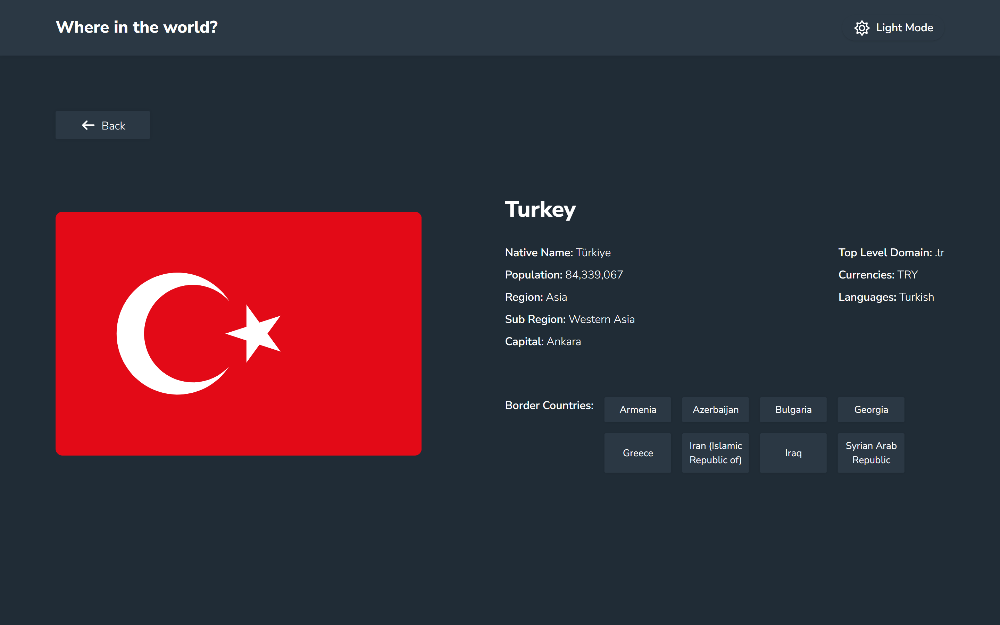

# Frontend Mentor - REST Countries API with color theme switcher solution

This is a solution to the [REST Countries API with color theme switcher challenge on Frontend Mentor](https://www.frontendmentor.io/challenges/rest-countries-api-with-color-theme-switcher-5cacc469fec04111f7b848ca).

## Table of contents

- [Overview](#overview)
  - [The challenge](#the-challenge)
  - [Screenshot](#screenshot)
  - [Links](#links)
- [My process](#my-process)
  - [Built with](#built-with)
- [Author](#author)

## Overview

### The challenge

Users should be able to:

- See all countries from the API on the homepage
- Search for a country using an `input` field
- Filter countries by region
- Click on a country to see more detailed information on a separate page
- Click through to the border countries on the detail page
- Toggle the color scheme between light and dark mode *(optional)*

### Screenshot

### Links

- Solution URL: [GitHub](https://github.com/g-akca/countries-app)
- Live Site URL: [Countries App](https://g-akca.github.io/countries-app/)

## My process

### Built with

- Semantic HTML5 markup
- CSS custom properties
- Flexbox
- CSS Grid
- Mobile-first workflow
- Responsive design
- Light and dark mode
- Dynamic JavaScript
- [React](https://reactjs.org/) - JS library
- [React Router](https://reactrouter.com/) - React library
- [Tailwind CSS](https://tailwindcss.com/) - CSS framework
- [Font Awesome](https://fontawesome.com/) - Icons
- [Material UI](https://mui.com/material-ui/react-pagination/) - Pagination component
- [Rest Countries API](https://restcountries.com/) - Countries API

## Author

- GitHub - [@g-akca](https://github.com/g-akca)
- Frontend Mentor - [@g-akca](https://www.frontendmentor.io/profile/g-akca)